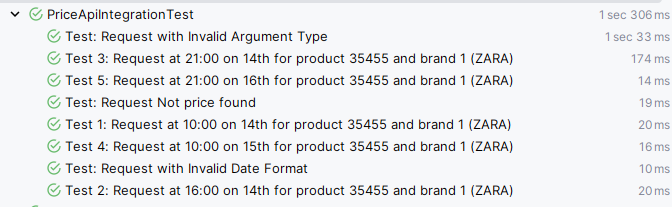
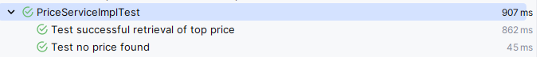

# PriceList Microservice

## What It Does
The PriceList Microservice provides an endpoint that accepts the following input parameters: application date, product identifier, and brand identifier (`BrandId`, `ProductId`, `date`). It returns the following data: product identifier, brand identifier, applicable rate, application dates, and final price to apply (`ProductId`, `BrandId`, `priceList`, `startDate`, `endDate`, `price`). This information is queried from the `PRICES` table.

## Getting Started

### Prerequisites
- Java version 17
- Maven version 3 or later

### Installation
1. Clone the project using:
   ```git clone https://github.com/emilio89/pricelistservice.git```
2. Download dependencies using:
   ```mvn clean install```
3. Launch the application (it will run on port 5555):
   ```mvn spring-boot:run```
4. Access Swagger UI to interact with the API:
   http://localhost:5555/pricelist-api.html

### Swagger UI example


### Running the Tests
Execute the following command to run the tests:
```mvn test```

## Built With
- **Spring-Boot**: A framework to ease the bootstrapping and development of new Spring applications.
- **DevTools**: Provides fast application restarts, LiveReload, and configurations for enhanced development experience.
- **H2 Database**: A lightweight, in-memory database for rapid development and testing.
- **Lombok**: Used to minimize boilerplate code for model/data objects.
- **MapStruct**: Simplifies the implementation of mappings between Java bean types, based on a convention over configuration approach.
- **SpringDoc-OpenAPI**: Integrates SpringBoot with OpenAPI 3 for API documentation.
- **JUnit**: A simple framework for writing and running automated tests.
- **Mockito**: A mocking framework for unit tests in Java.
- **TestContainers**: Provides lightweight, throwaway instances of common databases, Selenium web browsers, or anything else that can run in a Docker container for testing.

## Code Construction
The project follows an incremental construction approach, with frequent PRs and commits to demonstrate day-to-day work with GIT. The progress can be viewed at:
[https://github.com/emilio89/pricelistservice/pulls?q=](https://github.com/emilio89/pricelistservice/pulls?q=)

A good example of a PR created as a sample is:
[https://github.com/emilio89/pricelistservice/pull/3](https://github.com/emilio89/pricelistservice/pull/3)

Unit tests have been created for the service and controller, and integration tests using TestContainers to ensure the integrated functionality of the entire system.

## Example execution tests
Example of execution of the integration tests requested in the practice 


Example additional unit tests



## Application Deployment Address

The application is deployed at: [https://pricelistservice.onrender.com/pricelist-api.html](https://pricelistservice.onrender.com/pricelist-api.html)

### Deployment Details

To demonstrate the functionality of the created endpoint, the application has been deployed on a free server using Docker. This is primarily for testing and demonstration purposes.

**Note on Availability:**
As the application is hosted on a free server, 100% uptime cannot be guaranteed. This means there might be occasional downtimes due to server limitations or maintenance periods. We appreciate your understanding and recommend considering this while testing and using the application.
